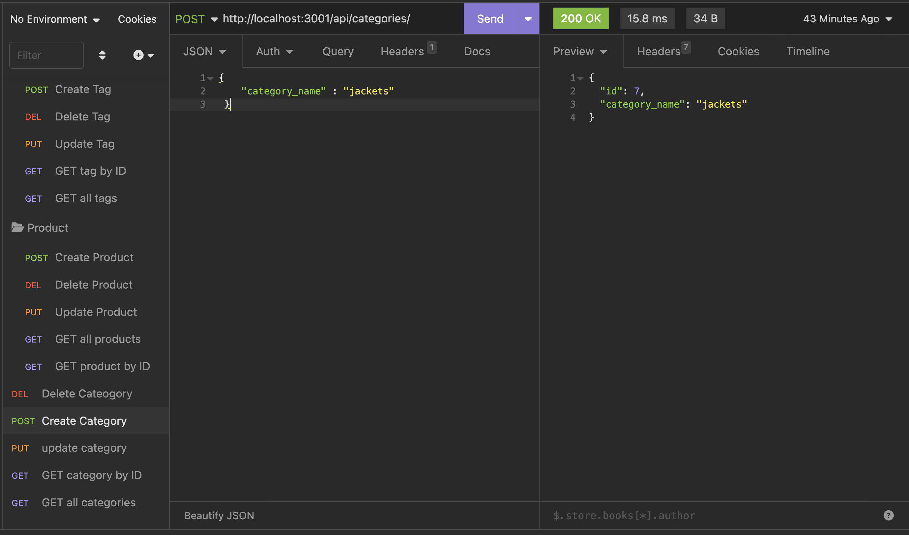
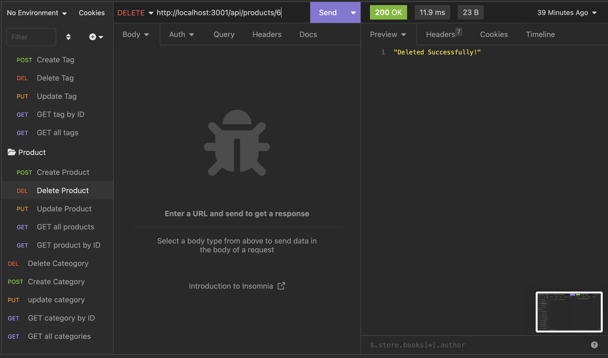
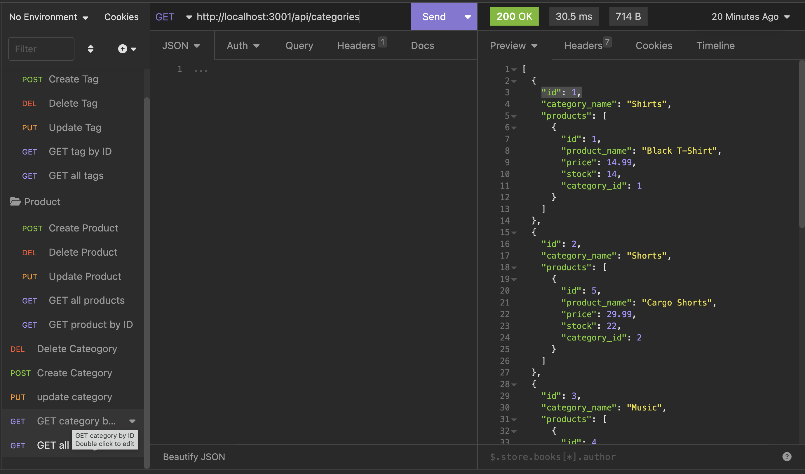
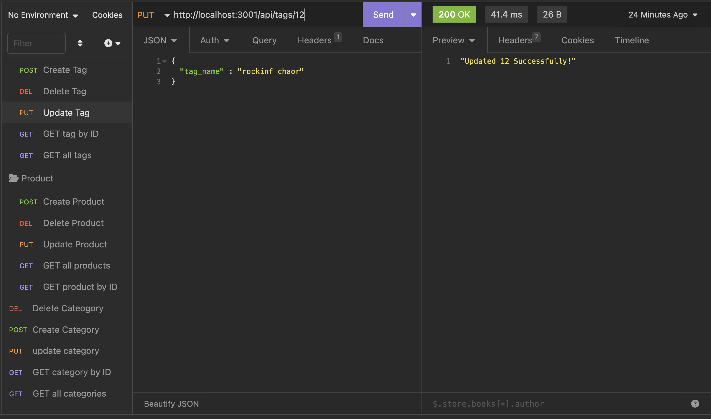

# E-Commerce-backend

## Description

This application is to manage the E-Commerce backend using Sequalize ORM for database handling and express.js as backend. User can add/delete/modify the Catefory/Product/Tag data. Relationships are defined between those Tables. All the credentials are stored in .env file.

## Technology Used

| Nodejs | [https://nodejs.org/docs/latest-v16.x/api/](https://nodejs.org/docs/latest-v16.x/api/)     |  
| Sequalize | [https://sequelize.org/](https://sequelize.org/)     |  
| dotenv | [https://www.npmjs.com/package/dotenv](https://www.npmjs.com/package/dotenv)     | 

## Usage

All the database/table creation are stored in schema.sql file and initial values are in seeds.js file using Sequalize ORM. The model defines the table columns primary key/ foreign key and other constraints for the table fields. This application is invoked using command line (npm start). Before invoking, schema is executed and data is feeded to DB using seeds file. All the HTTP requests are handled using Insomnia. User can find all Categories/Products/Tags, find Category/Product/Tag by ID, Update/Create/Delete Category/Product/Tag by ID.

Below is the sample HTTP requests made for this application

Create Category using POST HTTP method

Delete Product using DELETE HTTP method

Get all  Category using GET HTTP method

Update Tag using PUT HTTP method

## Demo

Walkthrough video of using this app is in the following link

Google Drive Link - https://drive.google.com/file/d/17AzMivmKjfaSlslYVV99keh4qK8w9Lhb/view

## Learning points

* using npm dotenv package to store credentials
* using sequalize ORM for database handling

## Links

Github Repo - https://github.com/srinithi19/E-Commerce-backend  
Application URL - https://srinithi19.github.io/E-Commerce-backend/

